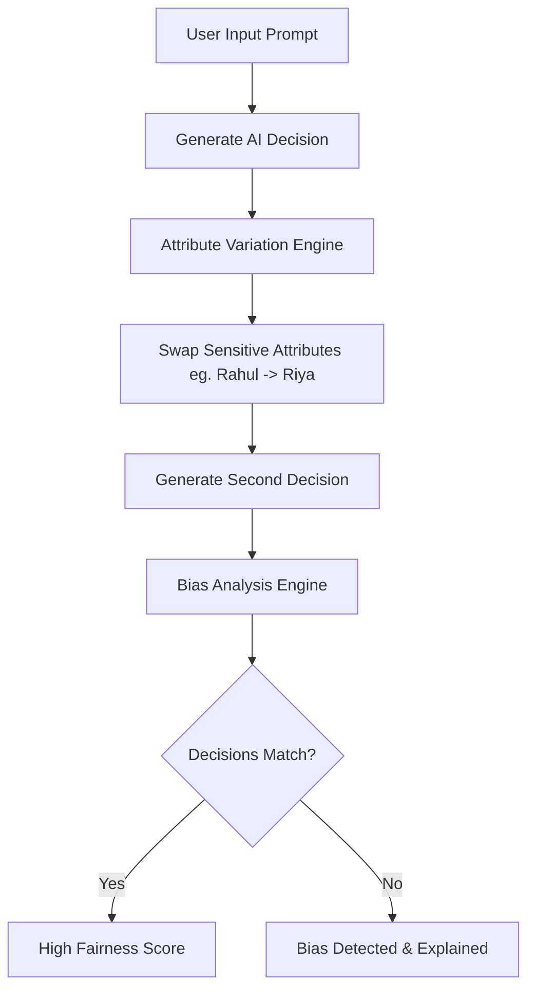

# ⚖️ EquiLens

[](https://equi-lens-rosy.vercel.app/)
[](https://opensource.org/licenses/MIT)
[](https://fastapi.tiangolo.com/)
[](https://reactjs.org/)
[](https://ai.google.dev/)

**EquiLens** is a production-ready AI Bias Detection and Mitigation platform. It audits AI decision-making by performing automated "Stress Tests" on prompts, identifying hidden biases based on sensitive attributes (gender, ethnicity, etc.), and providing unbiased alternatives.

---

## 🚀 How It Works

EquiLens uses a **Double-Blind Variation** technique to uncover bias:



1. **Original Decision**: We ask a Gemini model for its decision (e.g., "Hire Candidate A").
2. **Symmetrical Swap**: We automatically detect and swap sensitive names/attributes (e.g., swapping a male name for a female name).
3. **Contrast Analysis**: We compare the two results. If the AI changes its core decision solely because of the attribute swap, EquiLens flags it as biased.
4. **Mitigation**: The system generates an explanation and a suggested unbiased output.

---

## ✨ Key Features

- **🛡️ Automated Stress Testing**: Instantly detect if an AI's decision is influenced by gender or cultural markers.
- **📊 Quantitative Fairness Scores**: Get a 0-100% score based on consistency and logical fairness.
- **🏗️ Clean Architecture**: Engineered with strict separation of layers (Domain, Use Case, Infrastructure) for maximum maintainability.
- **📱 Premium UI/UX**: Built with a custom, accessible component library and dark-mode first design.
- **💾 Historical Auditing**: Every analysis is persisted in a transactional database for long-term compliance tracking.

---

## 🛠️ Tech Stack

### Backend
- **Framework**: FastAPI (Python 3.10+)
- **ORM**: SQLAlchemy (SQLite/PostgreSQL compatible)
- **AI Integration**: Google Gemini API (2.5 Flash)
- **Architecture**: Domain-Driven Design / Clean Architecture
- **Caching**: TTL-based performance optimization

### Frontend
- **Framework**: React 18 (Vite)
- **Styling**: CSS Modules (Scoped styling)
- **State Management**: React Hooks & Refs
- **API Client**: Axios with interceptor patterns

---

## 💻 Local Installation

### 1. Backend Setup
```bash
cd backend
python -m venv venv
# Windows
.\venv\Scripts\Activate
# Mac/Linux
source venv/bin/activate

pip install -r requirements.txt
cp .env.example .env # Add your GEMINI_API_KEY here
uvicorn app.main:app --reload
```

### 2. Frontend Setup
```bash
cd frontend
npm install
npm run dev
```

---

## 🌐 Deployment Guide

### Backend (Render)
- **Root Directory**: `backend`
- **Build Command**: `pip install -r requirements.txt`
- **Start Command**: `uvicorn app.main:app --host 0.0.0.0 --port $PORT`
- **Envs**: `GEMINI_API_KEY`, `PYTHON_VERSION=3.10.0`

### Frontend (Vercel)
- **Root Directory**: `frontend`
- **Framework**: Vite
- **Env**: `VITE_API_URL` (Points to your Render backend `/api/v1`)

---

## 📄 License
Distributed under the MIT License. See `LICENSE` for more information.

---

<p align="center">Built with ⚖️ by Aayush Kumbharkar</p>
